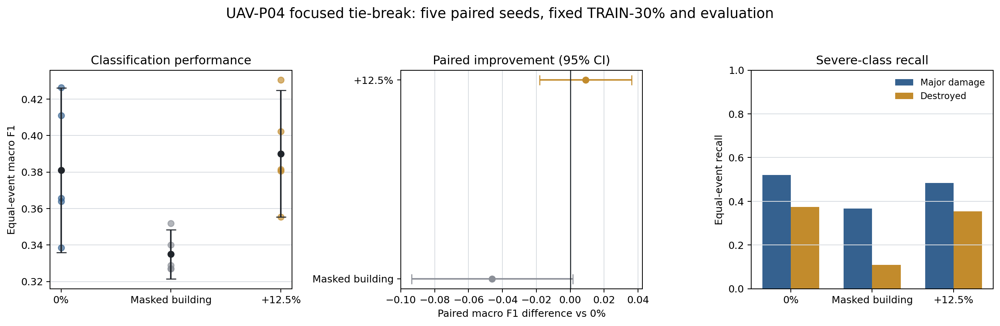
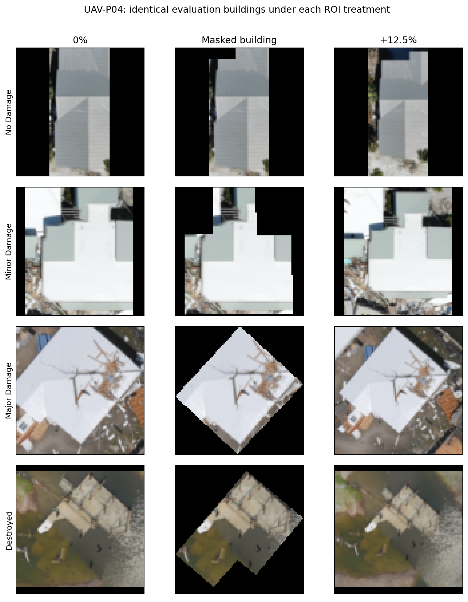
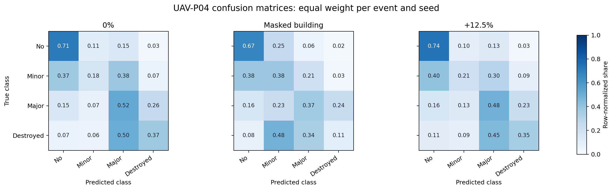

# UAV-P04: final ROI-margin selection

## Decision

**Keep the current 0% building bounding box. Reject the masked-building and
+12.5% alternatives for the frozen UAV preprocessing pipeline.**

+12.5% obtained the highest mean macro F1, but its improvement over 0% was
only **+0.0090** and its paired 95% confidence interval included zero
(`−0.0181` to `+0.0361`). It won three of five seeds and Hurricane Ida, while
0% won two seeds and Hurricane Ian. The added margin therefore did not show a
reliable or event-stable improvement.

The correct conclusion is not that 0% has been proven universally optimal.
It is that **neither added preprocessing treatment proved better than the
current input**, so the simpler 0% configuration is retained under the
predeclared rule. The result is the best choice among the three tested
variants, not a continuous mathematical optimum.



The left panel shows all five paired seeds and each mean with its 95%
confidence interval. The middle panel shows the paired difference from 0%; an
interval crossing the vertical zero line means that improvement was not
demonstrated. The right panel checks the two severe-damage recall guardrails.

## Controlled test

The focused confirmation compared only:

- **0%:** the current building bounding box, including any incidental context
  already inside the rectangle;
- **masked building:** the same 0% box with pixels outside the polygon set to
  black;
- **+12.5%:** add 12.5% of bounding-box width or height to each corresponding
  side.

All variants preserved aspect ratio and used symmetric black padding to make
the input square. UAV-P01 alpha validity was retained. Global auto-contrast
and median filtering were not reintroduced.

The same 207 TRAIN-30% buildings were used in every run:

| Class | Training buildings |
|---|---:|
| No damage | 77 |
| Minor damage | 72 |
| Major damage | 38 |
| Destroyed | 20 |
| **Total** | **207** |

Evaluation used the same fixed, deterministic, class-stratified 30% sample
from two additional official-Train orthomosaics in every variant and seed:

| Evaluation orthomosaic | Event | Buildings |
|---|---|---:|
| `1002-Ft-Myers-Beach-TFD.geo.tif` | Hurricane Ian | 228 |
| `20210902-LA-DIV-01.geo.tif` | Hurricane Ida | 103 |
| **Total** |  | **331** |

The evaluation set contains 125 no-damage, 91 minor-damage, 50 major-damage,
and 65 destroyed buildings. Ian and Ida metrics were calculated separately
and then averaged with equal weight, preventing the larger Ian set from
dominating the decision.

The test completed **15 real training/evaluation runs**: three variants times
five paired seeds (`17`, `29`, `43`, `59`, and `71`). Every run used the same
four-block CNN trained from scratch, 96 × 96 RGB input, normalization,
class-weighted cross-entropy, AdamW, learning rate 0.001, batch size 16, 25
fixed epochs, no augmentation, no scheduler, and the final epoch. The same
seed produced the same initialization and minibatch order across variants.

## Results

Values below are five-seed means after giving Ian and Ida equal weight.

| Variant | Macro F1 ± SD | 95% CI | Weighted F1 | Balanced accuracy | Major recall | Destroyed recall |
|---|---:|---:|---:|---:|---:|---:|
| **0% — selected** | 0.3811 ± 0.0363 | [0.3360, 0.4262] | 0.4199 | 0.4455 | **0.5200** | **0.3734** |
| +12.5% | **0.3901 ± 0.0280** | [0.3553, 0.4248] | **0.4333** | **0.4480** | 0.4838 | 0.3531 |
| Masked building | 0.3350 ± 0.0109 | [0.3215, 0.3485] | 0.3894 | 0.3821 | 0.3657 | 0.1085 |

### Paired comparison with 0%

| Candidate | Macro-F1 difference | 95% CI | Seed wins | Severe-recall guardrail |
|---|---:|---:|---:|---|
| +12.5% | +0.0090 | [−0.0181, +0.0361] | 3 / 5 | Pass, but both recalls decreased |
| Masked building | −0.0461 | [−0.0936, +0.0015] | 0 / 5 | **Fail** |

### Why a +0.0090 mean improvement was not selected

An increase of 0.0090 macro F1 could matter if it were repeatable. Here it is
equivalent to 0.9 points on a 0–100 macro-F1 scale, but it was smaller than the
observed seed-to-seed uncertainty. The paired +12.5%-minus-0% differences were:

| Seed | Paired macro-F1 difference |
|---:|---:|
| 17 | +0.0167 |
| 29 | +0.0042 |
| 43 | −0.0087 |
| 59 | −0.0101 |
| 71 | +0.0429 |

Thus, +12.5% did not consistently improve the same task: it helped in three
seeds and hurt in two, with much of its average advantage coming from seed 71.
The interval supported by these five paired observations ranges from a
possible 0.0181 loss to a possible 0.0361 gain. This does **not** prove that the
two variants are identical; it means the experiment did not establish that
the added margin is reliably better. Under the predeclared rule, an
unproven added treatment does not replace the simpler current input.

+12.5% reduced major-damage recall by 3.62 percentage points and destroyed
recall by 2.02 points. These reductions stay inside the five-point guardrail,
but there is still no statistically clear macro-F1 improvement. Masking was
worse than 0% in every seed and reduced major and destroyed recall by 15.43
and 26.48 points respectively.

### Results by event

| Variant | Hurricane Ian macro F1 | Hurricane Ida macro F1 | Equal-event mean |
|---|---:|---:|---:|
| **0%** | **0.3747** | 0.3875 | 0.3811 |
| +12.5% | 0.3742 | **0.4060** | **0.3901** |
| Masked building | 0.3400 | 0.3301 | 0.3350 |

The winner changes by event. On Ian, 0% and +12.5% are effectively tied; on
Ida, +12.5% is higher. This instability is another reason not to freeze the
added margin.

## What changes visually



The figure uses the same four fixed evaluation buildings in every column and
includes both new orthomosaics and all four classes. Masking removes all
outside context and creates artificial black boundaries. +12.5% adds visible
surroundings but reduces the building's share of the fixed 96 × 96 input.

On the evaluation set, the building occupied 47.90% of the 0% canvas and
31.41% with +12.5%; visible context increased from 42.22% to 58.67%. These are
diagnostics only and were not used to choose the configuration.



The confusion matrices explain the severe-class guardrail: masking reduced
destroyed recall to 0.11, while 0% retained 0.37. +12.5% remained close to 0%
but did not improve either severe class.

## Leakage and data-boundary audit

The audit passed before training:

- zero overlapping sample or building IDs;
- zero overlapping orthomosaic, flight-surrogate, or sequence-surrogate
  groups;
- zero exact duplicate groups crossing the split;
- zero pHash perceptual-duplicate groups crossing the split at Hamming
  distance ≤ 6;
- zero alpha-based sample rejections among the 1,103 eligible new evaluation
  candidates;
- zero internal-test rows, annotation objects, or pixels read;
- zero final-event reads.

Native flight and sequence IDs are unavailable, so the complete orthomosaic is
used as the conservative surrogate group. Training and evaluation use four
different orthomosaics. Both new sources are in the official CRASAR-U-DROIDs
`Train` partition; official `Test` events remain untouched.

## Limitations

- The comparison contains four orthomosaics from only two hurricane events.
  It tests transfer to new orthomosaics, not to a completely unseen disaster.
- TRAIN-30% contains only 20 destroyed buildings.
- The fixed reference classifier is a small CNN trained from scratch at
  96 × 96. The absolute scores are not claims about the eventual final model.
- Only 0%, masked building, and +12.5% were confirmed in this tie-break. This
  is sufficient to resolve the shortlisted options but not to identify a
  continuous mathematical optimum.

These limitations do not justify another ROI-margin experiment now. The
lowest-cost scientifically defensible action is to freeze **0%** for UAV-P04
and continue to the next preprocessing step. Generalization to a new disaster
must still be assessed once, later, using the untouched final event after the
entire pipeline is frozen.

## Minimal reproducibility package

- Focused experiment implementation:
  [`run_uav_p04_tiebreak_experiment.py`](../../scripts/run_uav_p04_tiebreak_experiment.py)
- Shared classifier and ROI implementation used by the focused experiment:
  [`run_uav_p04_classifier_experiment.py`](../../scripts/run_uav_p04_classifier_experiment.py)
- Automated checks:
  [`test_uav_p04_tiebreak_experiment.py`](../../tests/test_uav_p04_tiebreak_experiment.py)
- Historical TRAIN-30% source assignments:
  [`uav_p04_looo_manifest.csv`](../../reports/preprocessing/uav_p04_classifier/uav_p04_looo_manifest.csv)
- Fixed IDs and duplicate groups:
  [`uav_p04_tiebreak_manifest.csv`](../../reports/preprocessing/uav_p04_tiebreak/uav_p04_tiebreak_manifest.csv)
- Exact training configuration and seeds:
  [`training_config.json`](../../reports/preprocessing/uav_p04_tiebreak/training_config.json)
- Machine-readable final decision:
  [`summary.json`](../../reports/preprocessing/uav_p04_tiebreak/summary.json)
- One row per run:
  [`run_metrics.csv`](../../reports/preprocessing/uav_p04_tiebreak/run_metrics.csv)
- Compact comparison:
  [`margin_comparison.csv`](../../reports/preprocessing/uav_p04_tiebreak/margin_comparison.csv)
- Paired intervals:
  [`paired_differences.csv`](../../reports/preprocessing/uav_p04_tiebreak/paired_differences.csv)
- Per-event comparison:
  [`event_comparison.csv`](../../reports/preprocessing/uav_p04_tiebreak/event_comparison.csv)
- Leakage audit:
  [`leakage_audit.json`](../../reports/preprocessing/uav_p04_tiebreak/leakage_audit.json)

Detailed per-building predictions, intermediate training curves, and raw
confusion tables are retained locally but intentionally excluded from the
minimal GitHub package. The exact command below regenerates them.

Exact command:

```bash
MPLCONFIGDIR=/tmp/uav_p04_mpl python3 scripts/run_uav_p04_tiebreak_experiment.py \
  --data-root /path/to/crasar_uas_preprocessing_dev_v1 \
  --source-manifest reports/preprocessing/uav_p04_classifier/uav_p04_looo_manifest.csv \
  --output-dir reports/preprocessing/uav_p04_tiebreak \
  --assets-dir docs/assets/uav-preprocessing
```

No GeoTIFF, annotation source file, crop collection, model weight, or
checkpoint is included in the repository.
